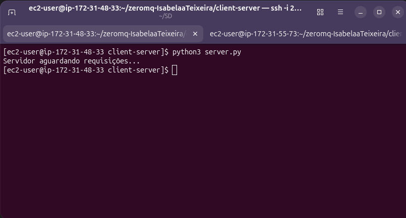
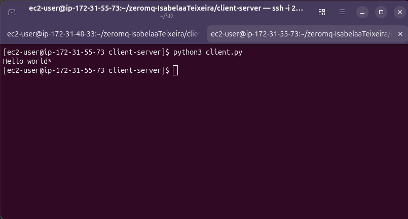
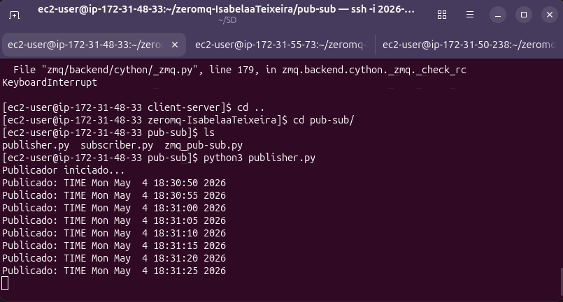
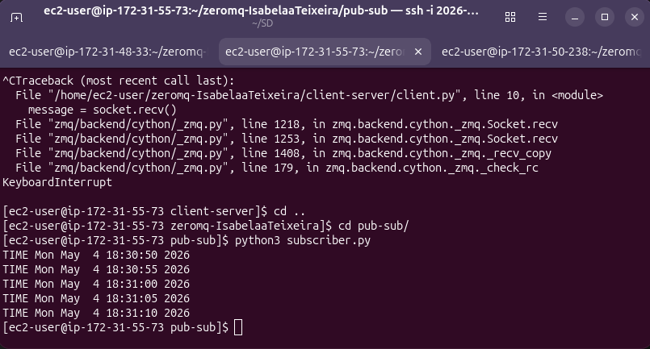
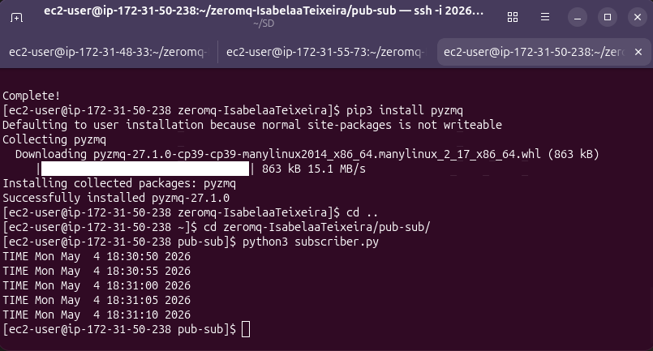
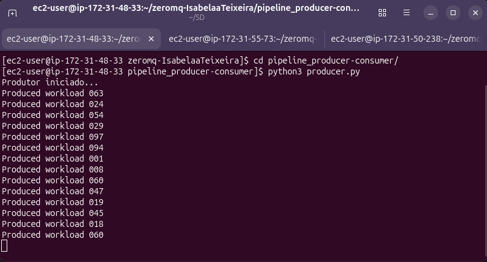
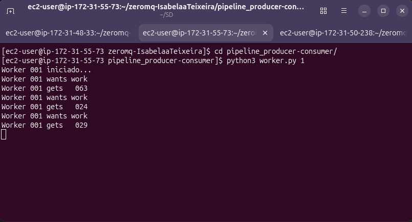
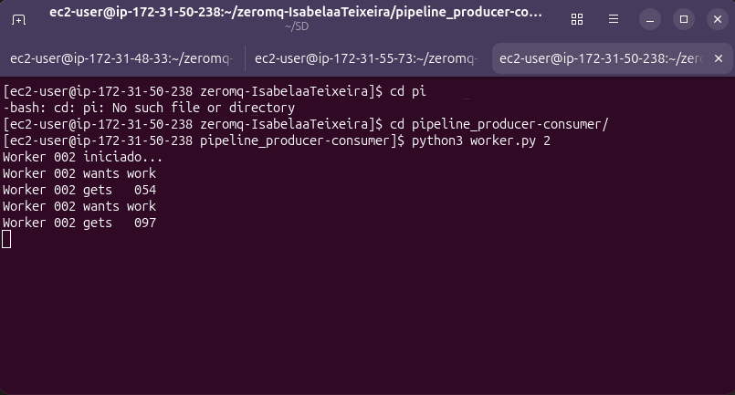

# ZeroMQ-Examples - Padrões de Comunicação em Ambiente Distribuído

## 1. Configuração da Infraestrutura (AWS)

Para os experimentos, foram utilizadas 3 instâncias EC2 distintas na AWS, representando os nós do sistema: 1 instância central (**Server/Publisher/Producer**) e 2 instâncias auxiliares (**Peers atuando como Clients/Subscribers/Workers**).

### Acessando as instâncias via SSH
O acesso foi realizado via terminal utilizando o usuário padrão `ec2-user`:

- **Terminal 1 (Server):** `ssh -i 2026-1-east.pem ec2-user@34.193.244.125`
- **Terminal 2 (Peer 1):** `ssh -i 2026-1-east.pem ec2-user@54.175.226.212`
- **Terminal 3 (Peer 2):** `ssh -i 2026-1-east.pem ec2-user@54.160.71.114`

### Configuração de Rede e Endereçamento
Para permitir a comunicação interna rápida e segura dentro da VPC da AWS, utilizamos o **IP Privado** da máquina servidora nos códigos dos clientes. A porta padronizada para os testes foi a `12345`:

- **IP Privado do Servidor:** `172.31.48.33`
- **Porta utilizada:** `12345`

### Regras de Segurança (Firewall / Security Group)
Para que os processos nas máquinas "Peers" conseguissem alcançar o "Server", foi necessário liberar a comunicação na rede da AWS:
- **Servidor:** Foi adicionada uma regra de entrada (**Inbound Rule**) no *Security Group* liberando a porta **TCP `12345`** para a origem `0.0.0.0/0` (Anywhere-IPv4).

---

## 2. Descrição dos Mecanismos de Comunicação (ZeroMQ)

O ZeroMQ foi utilizado para simplificar o envio de mensagens de rede através dos seguintes padrões:
1. **Cliente-Servidor (REQ / REP):** Padrão de requisição e resposta. O cliente solicita, o servidor processa e devolve.
2. **Publish-Subscribe (PUB / SUB):** Padrão de difusão. O Publicador emite dados e os Assinantes recebem as atualizações dos tópicos assinados.
3. **Pipeline (PUSH / PULL):** Padrão de distribuição de tarefas. Um produtor gera cargas de trabalho e as distribui entre múltiplos workers disponíveis (balanceamento de carga).

---

## 3. Adaptação para Ambiente Distribuído

A versão original utilizava `multiprocessing` para simular os nós localmente. A adaptação para AWS consistiu em:

- **Desacoplamento:** Separação das funções em arquivos `.py` independentes para execução em terminais distintos.
- **Modificações nos Sockets (Bind e Connect):**
  - **Serviços (Bind):** Configurados para `tcp://*:12345` para aceitar conexões externas.
  - **Clientes (Connect):** Configurados com o IP privado do servidor `tcp://172.31.48.33:12345`.

---

## 4. Ordem de Execução e Resultados

### Experimento 1: Cliente-Servidor (`client-server`)
1. No **Server**: `python3 server.py`
2. No **Peer 1**: `python3 client.py`

*Resultado: O cliente envia "Hello world", o servidor responde com "Hello world\*" e finaliza após receber o comando "STOP".*

**Imagens do Experimento:**

### Experimento 2: Publish-Subscribe (`pub-sub`)
1. No **Server**: `python3 publisher.py`
2. No **Peer 1** e **Peer 2**: `python3 subscriber.py`

*Resultado: O servidor publica horários continuamente. Ambos os assinantes recebem os dados simultaneamente.*

**Imagens do Experimento:**

### Experimento 3: Produtor-Consumidor (`pipeline_producer-consumer`)
1. No **Server**: `python3 producer.py`
2. No **Peer 1**: `python3 worker.py 1`
3. No **Peer 2**: `python3 worker.py 2`

*Resultado: O produtor distribui workloads aleatórios. Os workers dividem a carga de trabalho de forma balanceada.*

**Imagens do Experimento:**

---

## 5. Análise de Semântica (Local vs AWS)

- **Latência:** No ambiente AWS, a latência de rede é real, exigindo que o sistema lide com tempos de conexão e regras de firewall que não existem no ambiente local.
- **Passagem por Valor:** Toda comunicação entre os nós é feita via serialização de dados (`pickle` ou `encode`), garantindo isolamento total de memória entre os processos.
- **Escalabilidade:** O uso do ZeroMQ na AWS permitiu adicionar múltiplos assinantes e workers sem alterar a lógica do servidor, provando a eficiência dos padrões de mensagens em sistemas distribuídos.